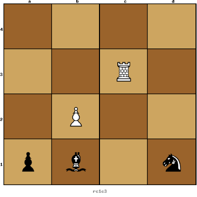

# TicTacChess AI



In this project I try to build an artificial intelligence that can play the game of Tic Tac Chess thanks to the [Minimax algorithm](https://en.wikipedia.org/wiki/Minimax) and [bitboards optimization](https://www.chessprogramming.org/Bitboards).

## Rules of TicTacChess

The TicTacChess is a variation of the TicTacToe which includes chess pieces instead of crosses and circles. It's played by 2 players on a 4x4 board, each player has four pieces including a pawn, a knight, a bishop and a rook. Each player play successively by either moving a piece, eating a enemy piece or placing a dead piece on an empty square of the board. A party is over when one of the player aligned all its pieces in a horizontal, vertical or diagonal line.

## How to play

You'll need to have [rust](https://www.rust-lang.org/) installed.

Clone this repos:
```
git clone https://github.com/charlyalizadeh/TicTacChess
```

Then you only need to generate the executable
```
cargo run --release
```

You can launch the game after the first time thanks to the following command (note: you have to execute this command from the main directory):
```
./target/release/tictacchess
```

## Wiki

* [Bitboard](https://github.com/charlyalizadeh/TicTacChess/blob/master/doc/bitboard_rep.md)
* [Magic optimization](https://github.com/charlyalizadeh/TicTacChess/blob/master/doc/magic_tutorial.md)
* [Usefull links](https://github.com/charlyalizadeh/TicTacChess/blob/master/doc/usefull_links.txt)

## Credits

* [rust-sfml](https://github.com/jeremyletang/rust-sfml)
* [Chess Programming Wiki](https://www.chessprogramming.org/Main_Page)
* [Binary converter](https://www.binaryhexconverter.com/binary-to-decimal-converter)
* [YT video on Bitboard](https://www.youtube.com/watch?v=MzfQ8H16n0M&)
* [Some blog about chess programming](https://peterellisjones.com/posts/generating-legal-chess-moves-efficiently/)
* [Paper on Magic Bitboard](http://pradu.us/old/Nov27_2008/Buzz/research/magic/Bitboards.pdf)
* [Article on Magic Bitboard](https://essays.jwatzman.org/essays/chess-move-generation-with-magic-bitboards.html)
* [Chess Programming wiki page on magic bitboard](https://www.chessprogramming.org/Magic_Bitboards)
* [Article on Magic bitboard](http://www.vicki-chess.blogspot.com/2013/04/magics.html)
